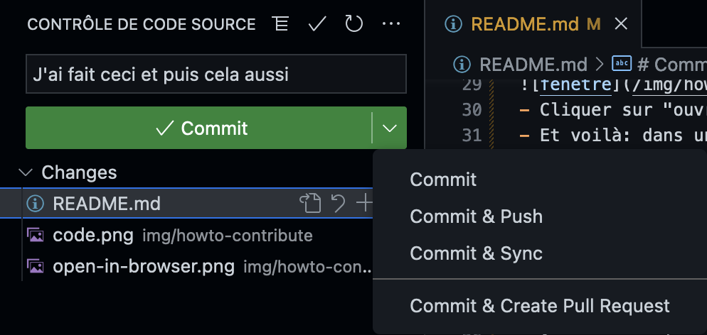
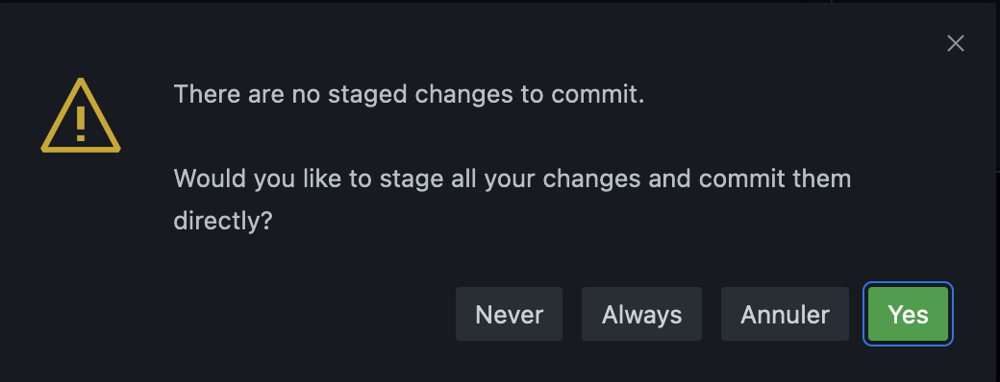

# AgiLille

# Comment ça marche ?

Le site est construit avec Jekyll et publié sur GitHub Pages.

On contribue en faisant un fork du projet, et une pull request.

Avec quelques notions de base de HTML, on peut apporter des changements à des pages.

Certains contenus sont générés par des fichiers YAML : liste des sponsors, le menu, etc. dans ce cas il faut éditer le fichier YML correspondant.

Il est conseillé de tester le résultat de sa contribution avant de la proposer sous forme de pull request.

# Comment contribuer ?

Après ce tuto, vous serez en mesure de proposer une contribution au site.  contribution que vous aurez pu tester au préalable sur une version privée du site d'AgiLille. Le tout en environ 10 minutes. C'est pas beau, ça ?

On va vous faire utiliser GitHub Codespaces, pour que tout soit testé dans un cloud, sans rien avoir à installer sur votre PC/Mac.

Voici les étapes d'une contribution :
- Créer un *fork* du repository - bouton en haut à droite:

- Valider avec "create fork" et attendre quelques secondes
- Cliquer sur le bouton vert "code" :

- Demander à créer un "codespace" sur master et attendre quelques dizaines de secondes.
- Cela vous ouvre un environnement de dev prêt à l'emploi, dans un cloud. Rien n'est installé sur votre PC/Mac.
- Dans le terminal en bas, taper la commande `./server.sh`
- Cette fenêtre apparaît:

- Cliquer sur "ouvrir dans un navigateur"

Et voilà : dans un nouvel onglet de prévisualisation, vous avez votre version privée d'AgiLille !

Maintenant vous pouvez revenir faire vos modifications dans l'onglet précédent. Et voir le résultat dans l'onglet de prévisualisation en le rafraîchissant.

Une fois que vous estimez vos modifications satisfaisantes :
- Appuyez sur les touches `ctrl maj G`
- Mettez un message bref qui décrit ce que vous proposez
- Cliquer sur le triangle à droite du bouton "commit"
- Sélectionner "commit & pull request":

- Là on sélectionne "always":

- Puis laissez-vous guider

Bravo, votre soumission est faite ! 
Une personne de Nord Agile est alors prévenue et va examiner votre proposition.

## Et si je préfère coder en local ?

Voici comment :

- Installer Docker.
- Lancer un terminal
- Se positionner dans le répertoire racine du repository 
- Puis lancer la commande suivante :

    ./server.sh

Après quelques secondes (quelques minutes au 1er lancement) vous pourrez alors saisir l'URL suivante dans votre navigateur :

    http://localhost:4000

Et voilà, votre AgiLille.fr local !

## Workflow

Pour publier, pousser vos modifications sur `master`:

    git checkout master
    # make your changes
    git add .
    git commit -m "Added: Something funny"
    git push
